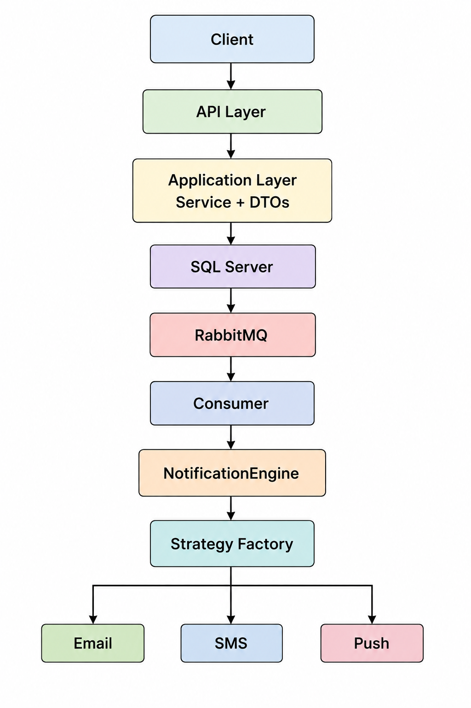

# NotificationPlatform

An event-driven notification platform built with **ASP.NET Core .NET 10**, supporting **Email, SMS, and Push Notifications**.

The system follows **Clean Architecture** and uses the **Strategy Pattern** and **RabbitMQ** for asynchronous notification processing.

---

## Features

- Email, SMS, and Push Notifications
- Asynchronous processing with RabbitMQ
- Retry mechanism with up to 3 attempts
- Strategy Pattern for notification providers
- ASP.NET Core Identity
- SQL Server with Entity Framework Core
- FluentValidation
- Swagger
- Docker
- Dependency Injection
- Background notification processing

---

## Architecture Diagram
<p align="center">

</p>

### Project Structure

```text
NotificationPlatform
│
├── src
│   ├── NotificationPlatform.Domain
│   │   ├── Entities
│   │   └── Enums
│   │
│   ├── NotificationPlatform.Application
│   │   ├── DTOs
│   │   ├── Interfaces
│   │   ├── Services
│   │   └── Validators
│   │
│   ├── NotificationPlatform.Infrastructure
│   │   ├── Data
│   │   ├── Identity
│   │   ├── Messaging
│   │   ├── NotificationEngine
│   │   ├── NotificationProviders
│   │   └── Persistence
│   │
│   └── NotificationPlatform.API
│       ├── Controllers
│       └── Program.cs
│
├── docs
│   ├── architecture.png
│   └── swagger.png
│
├── .gitignore
├── NotificationPlatform.slnx
└── README.md
```

---

## Retry Mechanism

Failed notification deliveries are retried up to **3 times**.

```text
Attempt 1
   │
   ├── Success → Sent
   └── Failure
         ↓
      Attempt 2
         │
         ├── Success → Sent
         └── Failure
               ↓
            Attempt 3
               │
               ├── Success → Sent
               └── Failure → Failed
```

Each delivery stores its **status, retry count, error message, and sent timestamp**.

---

## API

### Create Notification

```http
POST /api/Notifications
```

```json
{
  "userId": "USER_ID",
  "templateId": 1
}
```

### Get Notification

```http
GET /api/Notifications/{id}
```

---

## Testing

The system covers:

- Notification creation
- Notification retrieval
- RabbitMQ message publishing
- Consumer processing
- Notification provider selection
- Retry handling
- Delivery status updates

---

## Technologies

| Technology | Purpose |
|---|---|
| C# | Programming Language |
| .NET 10 | Application Framework |
| ASP.NET Core | Web API |
| RESTful API | API Design & Communication |
| Clean Architecture | Software Architecture |
| Entity Framework Core | ORM & Database Access |
| SQL Server | Relational Database |
| ASP.NET Core Identity | Authentication & User Management |
| RabbitMQ | Message Broker |
| BackgroundService | Background Processing |
| Strategy Pattern | Notification Provider Selection |
| Factory Pattern | Notification Sender Creation |
| FluentValidation | Request Validation |
| Swagger / OpenAPI | API Documentation |
| Docker | Containerization |
| Dependency Injection | Service Management |
| Git & GitHub | Version Control |
